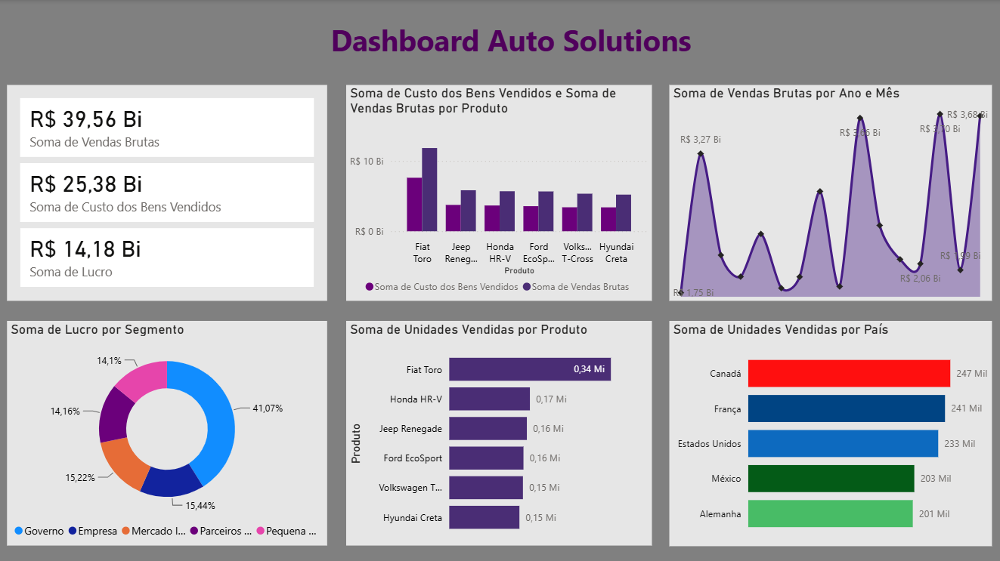

# 🚗 AutoSolutions — Sales Performance

Dashboard desenvolvido em Power BI para análise do desempenho histórico de vendas da AutoSolutions, empresa do mercado automobilístico.

## 🎯 Objetivo

Analisar os dados históricos de vendas para obter uma visão geral do desempenho comercial e apoiar o planejamento estratégico da empresa.

O projeto busca responder questões relacionadas a:

- Evolução das vendas brutas ao longo dos anos;
- Países com maior número de unidades vendidas;
- Relação entre custo e faturamento por produto;
- Desempenho dos segmentos de mercado em relação ao lucro;
- Produtos com maior volume de unidades vendidas.

## 📊 Principais KPIs

| Indicador | Resultado |
|---|---:|
| Vendas Brutas | **R$ 39,56 Bi** |
| Custo dos Bens Vendidos | **R$ 25,38 Bi** |
| Lucro | **R$ 14,18 Bi** |

## 💡 Principais Insights

### 📈 Vendas ao longo do tempo

O dashboard apresenta a evolução das vendas brutas por ano e mês, permitindo acompanhar as variações do desempenho comercial ao longo do período analisado.

### 🌎 Unidades vendidas por país

Entre os países apresentados no dashboard, o Canadá possui o maior volume de unidades vendidas, seguido por França, Estados Unidos, México e Alemanha.

### 🚗 Desempenho por produto

O **Fiat Toro** apresenta o maior volume de unidades vendidas entre os produtos analisados, com aproximadamente **340 mil unidades**.

O dashboard também compara o custo dos bens vendidos e as vendas brutas por produto.

### 💰 Lucro por segmento

O segmento **Governo** apresenta a maior participação no lucro, representando aproximadamente **41,07%** do total.

## 🛠️ Ferramentas

- Power BI
- DAX
- Power Query
- Data Analytics
- Business Intelligence
- Data Visualization

## 📈 Dashboard

## 📁 Arquivos

- `README.md` — documentação do projeto
- `dashboard.png` — imagem do dashboard
- `AutoSolutions.pbix` — arquivo do projeto Power BI

## 📌 Observação

Este projeto foi desenvolvido como case de mentoria em análise de dados e tem finalidade de estudo e composição de portfólio profissional.
