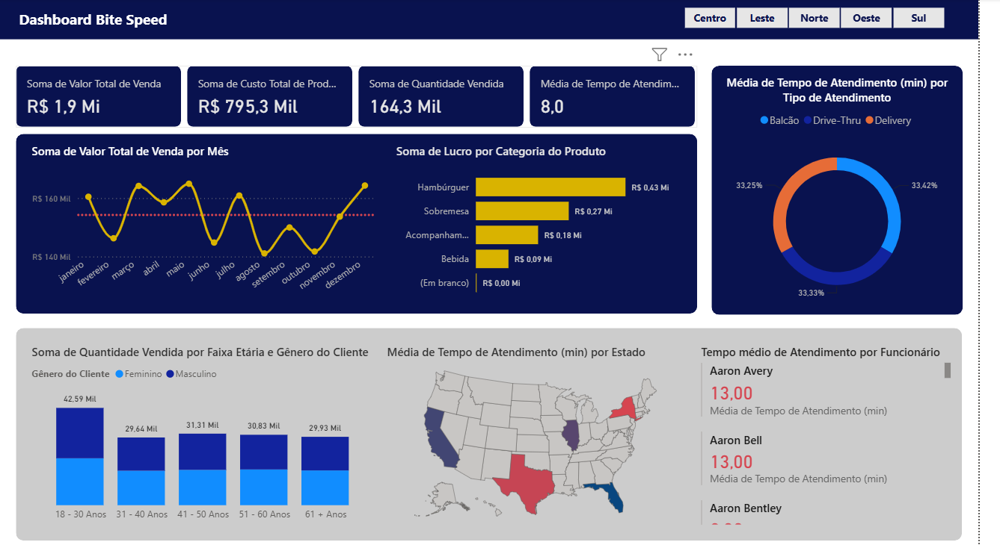

# 🍔 BiteSpeed USA — Sales & Operations Analysis

Dashboard desenvolvido em Power BI para análise do desempenho comercial e operacional da BiteSpeed USA.

## 🎯 Objetivo

Analisar dados de vendas, perfil dos clientes, atendimento e produtos, transformando dados em indicadores e insights para apoiar a tomada de decisão.

## 📊 Principais KPIs

- **Valor Total de Vendas:** R$ 1,9 Mi
- **Custo Total de Produtos:** R$ 795,3 Mil
- **Quantidade Vendida:** 164,3 Mil
- **Tempo Médio de Atendimento:** 8,0 min

## 💡 Principais Insights

- 🍔 **Hambúrguer** apresenta o maior lucro por categoria, com aproximadamente R$ 430 mil.
- 🍰 **Sobremesas** aparecem em segundo lugar, com aproximadamente R$ 270 mil.
- 👥 A faixa etária de **18–30 anos** apresenta o maior volume de unidades vendidas, com aproximadamente 42,59 mil unidades.
- 🎧 O tempo médio geral de atendimento analisado foi de **8 minutos**.

## 🛠️ Ferramentas

- Power BI
- Power Query
- DAX
- Data Analytics
- Business Intelligence
- Data Visualization

## 📈 Dashboard

## 📁 Arquivos

- `README.md` — documentação do projeto
- `dashboard.png` — imagem do dashboard
- `BiteSpeed.pbix` — arquivo do projeto Power BI
