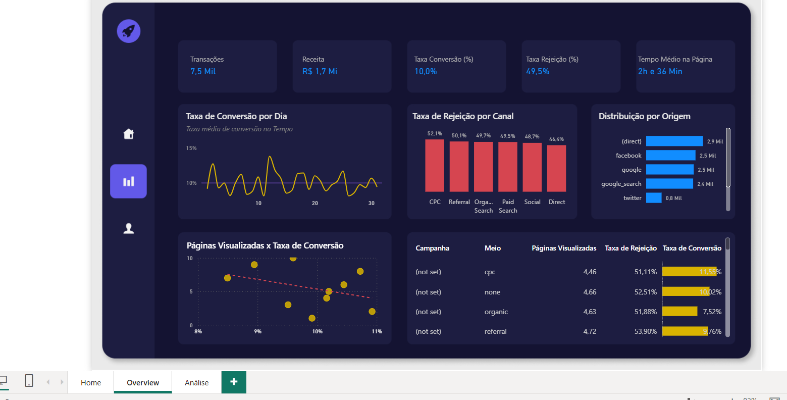

# 🚀 Tech Trends — Marketing Analytics

Dashboard desenvolvido em Power BI para análise de desempenho de marketing digital e comportamento dos usuários.

## 🎯 Objetivo

Analisar dados de tráfego, campanhas e comportamento dos usuários para identificar oportunidades de melhoria na conversão e no desempenho dos canais digitais.

## 📊 Principais KPIs

- Transações: 7,5 mil
- Receita: R$ 1,7 Mi
- Taxa de Conversão: 10,0%
- Taxa de Rejeição: 49,5%
- Tempo Médio na Página: 2h 36min

## 💡 Principais Insights

- A taxa média de conversão analisada ficou em aproximadamente 10%.
- A taxa de rejeição geral foi de 49,5%.
- A origem `(direct)` apresentou o maior volume de usuários, seguida por Facebook e Google.
- O dashboard permite comparar taxa de conversão, rejeição, páginas visualizadas e desempenho por canal/campanha.
- A análise também permite identificar relações entre páginas visualizadas e taxa de conversão.

## 🛠️ Ferramentas

- Power BI
- Power Query
- DAX
- Data Visualization
- Marketing Analytics
- Business Intelligence

## 📷 Dashboard

## 📁 Arquivos

- `TechTrends.pbix` — arquivo do projeto Power BI
- `dashboard.png` — imagem do dashboard
- `README.md` — documentação do projeto
